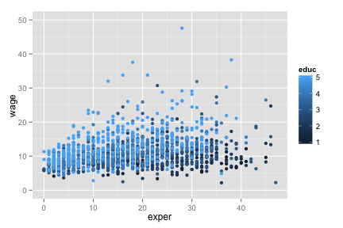

## Purpose of App

* Use economic data from the Ecdat package to see difference between different experience levels and education of Belgian workers
* Plots data and allows user to view data points of specific entries
* Reports mean of the subset
* App is available to use on [shinyapps](https://mjrichard.shinyapps.io/AppBelgiumWage)
* Convenient visualization of the data

---  

## Interactivity

* Multiple Options are given for which subset of the data to observe
* Look at wages for
    * The entire data set
    * A specific amount of experience across all education levels
    * A specific amount of education across all experience levels
    * A specific education and experience level
        * Will produce some empty data sets for some selections

---

## About the dataset

* From the Ecdat package (available from CRAN)
* Variables are
    * wage: Gross hourly wage in euro
    * educ: Education level on a scale from 1 to 5
    * exper: years of experience
    * sex: values not actually included in dataset

        

```r
library(Ecdat)
data(Bwages)
str(Bwages)
```

```
## 'data.frame':	1472 obs. of  4 variables:
##  $ wage : num  7.78 4.82 10.56 7.04 7.89 ...
##  $ educ : int  1 1 1 1 1 1 1 1 1 1 ...
##  $ exper: int  23 15 31 32 9 15 26 23 13 22 ...
##  $ sex  : Factor w/ 1 level "1='male';0='female'": NA NA NA NA NA NA NA NA NA NA ...
```

---

## Sample plot of the entire dataset


The mean of the data is 

```r
mean(Bwages$wage)
```

```
## [1] 11.05062
```


```r
qplot(exper, wage, data=Bwages,xlim=c(0,47),ylim=c(0,50), col=educ)
```

 


